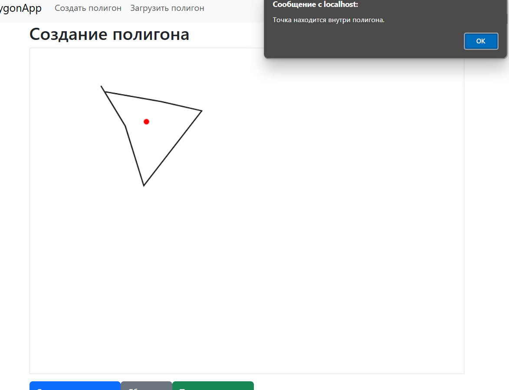
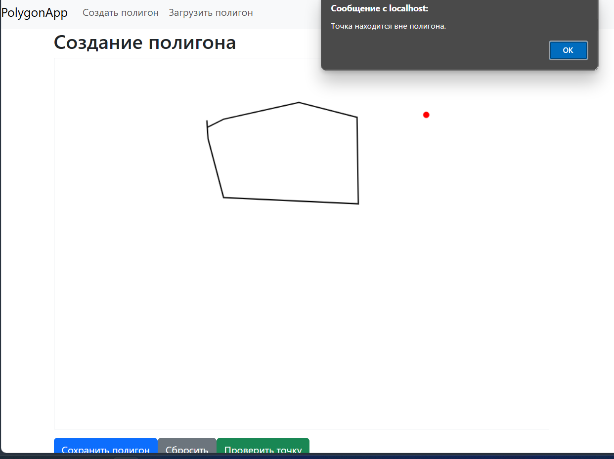
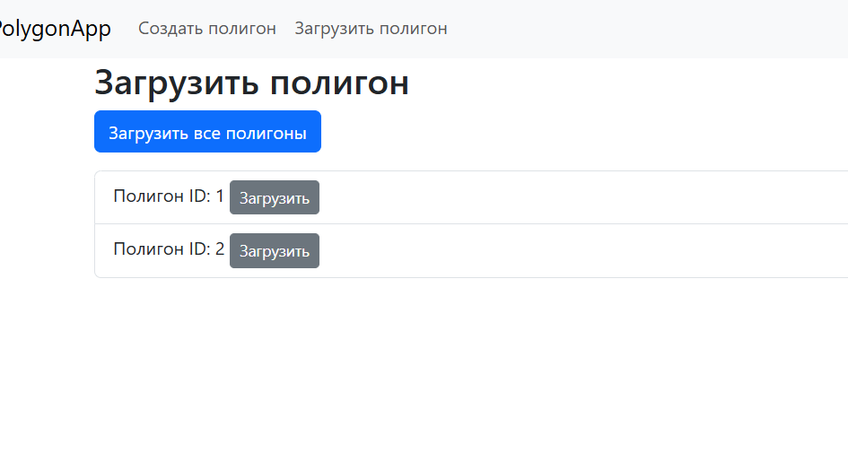

# CheckerPolygon Project

Проект **CheckerPolygon** представляет собой приложение для работы с полигонами, состоящее из backend на ASP.NET Core и frontend на Angular. Для упрощения развёртывания и управления обеими частями используется **Docker Compose**.

## Структура проекта

- `/backend` - серверная часть проекта на ASP.NET Core.
- `/polygon-app` - клиентская часть на Angular.

Для более детальной информации см. отдельные инструкции для каждой части:
- [Backend README](./backend/README.md)
- [Frontend README](./polygon-app/README.md)


## Пример работы программы
#### Нахождение точки внутри полигона


#### Нахождение точки внутри полигона


#### Загрузка 


## Запуск проекта

### Использование Docker Compose

Для запуска всех сервисов выполните следующую команду в корневом каталоге проекта:

```bash
docker-compose up --build
```

После запуска:
- **Backend API** будет доступен по адресу: `http://localhost:50150` или `http://ip:50150`
- **Frontend** будет доступен по адресу: `http://localhost:80` или `http://ip:80`

## Docker Compose

Docker Compose позволяет запускать и управлять несколькими сервисами, определёнными в одном файле, с использованием одной команды. Для проекта **CheckerPolygon** Docker Compose развёртывает оба компонента: **backend** и **frontend**.

### Docker Compose файл

Файл `docker-compose.yml` определяет конфигурацию двух сервисов: `backend` и `frontend`. Ниже описано, как работает каждая часть:

- **backend**:
  - Собирается на основе Dockerfile в папке `backend`.
  - Прослушивает запросы на порту 5000 и маппится на порт 50150 локально.
  - Определены переменные среды, такие как `ASPNETCORE_ENVIRONMENT` и `ASPNETCORE_URLS` для настройки среды разработки.

- **frontend**:
  - Собирается на основе Dockerfile в папке `polygon-app`.
  - Передаёт переменную `API_URL` для указания адреса backend.
  - Порт для фронтенда — 80, где Nginx обрабатывает запросы и перенаправляет их к Angular приложению.
  - Определена зависимость от `backend`, чтобы гарантировать запуск backend перед frontend.

### Сети

В проекте используется одна сеть `app-network`, которая соединяет backend и frontend для внутреннего взаимодействия. Это упрощает вызовы между сервисами.

## Запуск проекта с Docker Compose

Чтобы развернуть проект, выполните следующую команду из корневой папки проекта:

```bash
docker-compose up --build
```

Эта команда соберёт оба Docker образа и запустит контейнеры для каждого сервиса.

### Доступность

- После успешного запуска:
  - **Backend API** будет доступен по адресу: `http://localhost:50150` или `http://ip:50150`.
  - **Frontend** будет доступен по адресу: `http://localhost:80` или `http://ip:80`.

## Полезные команды

- **Запуск контейнеров**: `docker-compose up`
- **Пересобрать и запустить контейнеры**: `docker-compose up --build`
- **Остановка контейнеров**: `docker-compose down`
- **Проверка запущенных контейнеров**: `docker ps`


